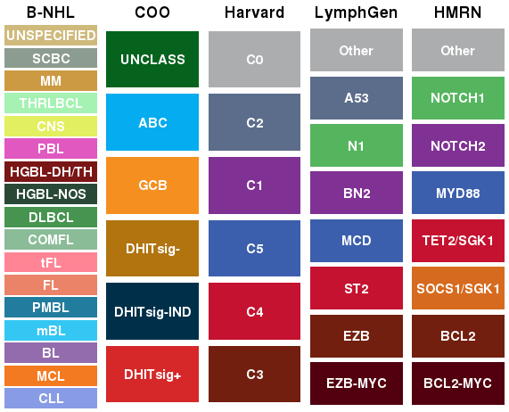
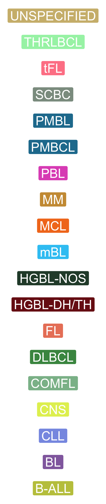

# ggsci  <a href="https://nanx.me/ggsci/"></a>

<!-- badges: start -->
[](https://github.com/nanxstats/ggsci/actions)
[](https://cran.r-project.org/package=ggsci)
[](https://cran.r-project.org/package=ggsci)
<!-- badges: end -->

`ggsci` offers a collection of `ggplot2` color palettes inspired by scientific journals, data visualization libraries, science fiction movies, and TV shows.

## Installation

Install `ggsci` from CRAN:

```r
install.packages("ggsci")
```

Or try the development version on GitHub:

```r
# install.packages("devtools")
devtools::install_github("nanxstats/ggsci")
```

[Browse the vignette](https://nanx.me/ggsci/articles/ggsci.html) (or open with `vignette("ggsci")` in R) for a quick-start guide.

## Lymphoma-centric colours



### General B-NHL subgroups of (or related to) DLBCL

b_cell_nhl_cols=ggsci::get_ash("b-cell")



|  Pathology  |   hex   |
|:-----------:|:-------:|
| CLL         | #889BE5 |
| MCL         | #F37A20 |
| BL          | #926CAD |
| mBL         | #34C7F4 |
| PMBL        | #227C9D |
| FL          | #EA8368 |
| tFL         | #FF8595 |
| COMFL       | #8BBC98 |
| DLBCL       | #479450 |
| HGBL-NOS    | #294936 |
| HGBL-DH/TH  | #7A1616 |
| PBL         | #E058C0 |
| CNS         | #E2EF60 |
| THRLBCL     | #A5F2B3 |
| MM          | #CC9A42 |
| SCBC        | #8c9c90 |
| UNSPECIFIED | #cfba7c |

## Cell of origin and gene expression subgroups

```r
coo_cols=ggsci::get_ash("coo")
```

| COO         | hex     |
|-------------|---------|
| DHITsig+    | #D62828 |
| DHITsig-IND | #003049 |
| DHITsig-    | #B1740F |
| GCB         | #F58F20 |
| ABC         | #05ACEF |
| UNCLASS     | #05631E |

## Genetic classes from Chapuy et al

```r
harvard_cols=ggsci::get_ash("harvard")
```

| Harvard | hex     |
|---------|---------|
| C3      | #721F0F |
| C4      | #C41230 |
| C5      | #3B5FAC |
| C1      | #7F3293 |
| C2      | #5b6d8a |
| C0      | #ACADAF |

## LymphGen classes from Schmitz et al with updates described in Wright et al

```r
lymphgen_cols=ggsci::get_ash("lymphgen")
```

| LymphGen | hex     |
|----------|---------|
| EZB-MYC  | #52000F |
| EZB      | #721F0F |
| EZB-COMP | #C7371A |
| ST2      | #C41230 |
| ST2-COMP | #EC3251 |
| MCD      | #3B5FAC |
| MCD-COMP | #6787CB |
| BN2      | #7F3293 |
| BN2-COMP | #A949C1 |
| N1       | #55B55E |
| N1-COMP  | #7FC787 |
| A53      | #5b6d8a |
| Other    | #ACADAF |

## HMRN classes from Lacy et al with updates described in Runge et al

```r
hmrn_cols=ggsci::get_ash("hmrn")
```

| HMRN       | hex     |
|------------|---------|
| BCL2-MYC   | #52000F |
| BCL2       | #721F0F |
| SOCS1/SGK1 | #D66B1F |
| TET2/SGK1  | #C41230 |
| MYD88      | #3B5FAC |
| NOTCH2     | #7F3293 |
| NOTCH1     | #55B55E |
| Other      | #ACADAF |


## Gallery

### NPG


### AAAS


### NEJM


### Lancet


### JAMA


### JCO


### UCSCGB


### D3


### LocusZoom


### IGV


### COSMIC


### UChicago


### Star Trek


### Tron Legacy


### Futurama


### Rick and Morty


### The Simpsons


### GSEA


### Material Design


## Contribute

To contribute to this project, please take a look at the [Contributing Guidelines](CONTRIBUTING.md) first. Please note that this project is released with a [Contributor Code of Conduct](CONDUCT.md). By participating in this project you agree to abide by its terms.
